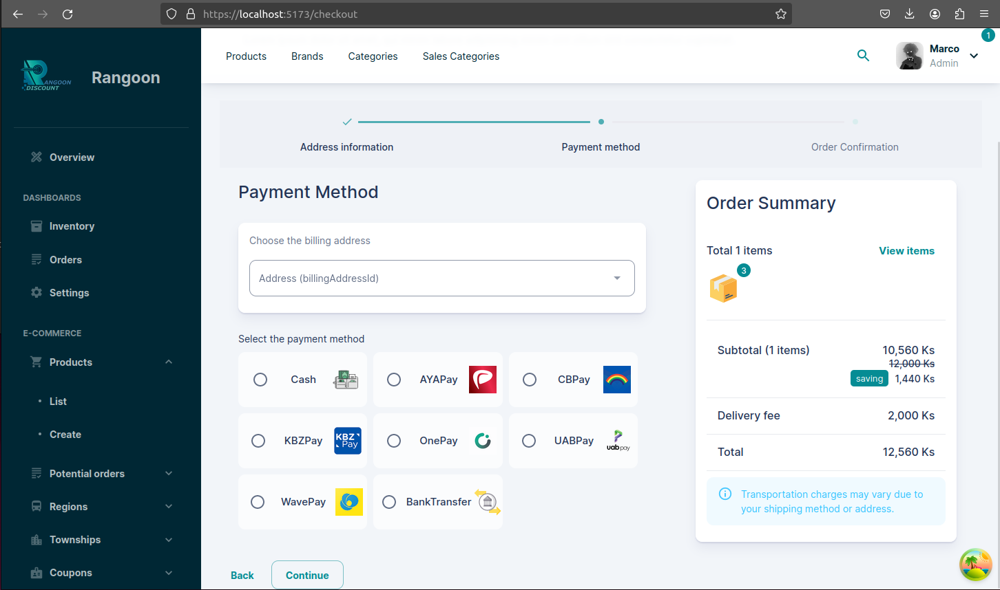

# Admin Dashboard

## Overview
Admin Dashboard is a full-stack application utilizing the SERN stack (SQL, Express, React, Node) with TypeScript for a robust and type-safe development experience.



## Features
- **Database:** PostgreSQL with Prisma for efficient data management.
- **Server:** Express in TypeScript for a robust backend.
- **Client:** React in TypeScript for a dynamic and responsive frontend.
- **UI:** Utilizes Material-UI Dashboard for a professional look and fully customizable UI.
- **Components:** Charts, tables, and a custom UI to enhance user experience.
- **Data Management:** React Query for efficient data fetching and management.
- **Forms:** Uses `react-hook-form` and Zod for form validation ensuring data integrity.
- **Authentication:** JWT and Google OAuth for secure user authentication.
- **Authorization:** Implements role-based access control system for better security.
- **Middleware:** Custom middleware for rate limiting with Redis and development-only logging.
- **Type Safety:** Entire codebase is written in TypeScript, ensuring type-safe operations.


---
## Tree directory
### Client tree
```txt
./client
├── cert.pem
├── client
├── index.html
├── key.pem
├── package.json
├── pnpm-lock.yaml
├── public
│  ├── audio
│  │  ├── denied.mp3
│  │  ├── error.mp3
│  │  └── success.mp3
│  ├── bannar.wasm
│  ├── default.jpg
│  ├── outdoor.svg
│  ├── profile_pp.png
│  ├── static
│  │  ├── access-denied.svg
│  │  ├── aya-pay.png
│  │  ├── bank-transfer.svg
│  │  ├── box.svg
│  │  ├── cash.svg
│  │  ├── cb-pay.png
│  │  ├── concept-of-data-privacy-and-policy.svg
│  │  ├── email.svg
│  │  ├── facebook.svg
│  │  ├── girl-announcing-shopping-super-sale.svg
│  │  ├── google.svg
│  │  ├── kbz-pay.png
│  │  ├── motorcycle-delivery.svg
│  │  ├── one-pay.png
│  │  ├── palm-recognition.svg
│  │  ├── rangoon.png
│  │  ├── reception-desk.svg
│  │  ├── status
│  │  │  ├── 404.svg
│  │  │  ├── 500.svg
│  │  │  ├── coming-soon.svg
│  │  │  └── maintenance.svg
│  │  ├── uab-pay.png
│  │  └── wave-pay.png
│  └── vite.svg
├── README.md
├── src
│  ├── __tests__
│  │  └── App.test.tsx
│  ├── App.tsx
│  ├── components
│  │  ├── AddDashboardCard.tsx
│  │  ├── AuthProvider.tsx
│  │  ├── BackdropProvider.tsx
│  │  ├── BulkActions.tsx
│  │  ├── cart
│  │  │  ├── CartsTable.tsx
│  │  │  └── index.tsx
│  │  ├── content
│  │  │  ├── accessLogs
│  │  │  │  ├── AccessLogsList.tsx
│  │  │  │  ├── AccessLogsListTable.tsx
│  │  │  │  └── index.ts
│  │  │  ├── auditLogs
│  │  │  │  ├── AuditLogsList.tsx
│  │  │  │  ├── AuditLogsListTable.tsx
│  │  │  │  └── index.ts
│  │  │  ├── brands
│  │  │  │  ├── BrandsFilterForm.tsx
│  │  │  │  ├── BrandsList.tsx
│  │  │  │  ├── BrandsListTable.tsx
│  │  │  │  ├── forms
│  │  │  │  │  ├── CreateBrandForm.tsx
│  │  │  │  │  ├── index.ts
│  │  │  │  │  └── UpdateBrandForm.tsx
│  │  │  │  └── index.ts
│  │  │  ├── categories
│  │  │  │  ├── CategoriesFilterForm.tsx
│  │  │  │  ├── CategoriesList.tsx
│  │  │  │  ├── CategoriesListTable.tsx
│  │  │  │  ├── forms
│  │  │  │  │  ├── CreateCategoryForm.tsx
│  │  │  │  │  ├── index.ts
│  │  │  │  │  └── UpdateCategoryForm.tsx
│  │  │  │  └── index.ts
│  │  │  ├── coupons
│  │  │  │  ├── CouponsFilterForm.tsx
│  │  │  │  ├── CouponsList.tsx
│  │  │  │  ├── CouponsListTable.tsx
│  │  │  │  ├── forms
│  │  │  │  │  ├── CreateCouponForm.tsx
│  │  │  │  │  ├── index.ts
│  │  │  │  │  └── UpdateCouponForm.tsx
│  │  │  │  └── index.ts
│  │  │  ├── exchanges
│  │  │  │  ├── ExchangesFilterForm.tsx
│  │  │  │  ├── ExchangesList.tsx
│  │  │  │  ├── ExchangesListTable.tsx
│  │  │  │  ├── forms
│  │  │  │  │  ├── CreateExchangeForm.tsx
│  │  │  │  │  ├── index.ts
│  │  │  │  │  └── UpdateExchangeForm.tsx
│  │  │  │  └── index.ts
│  │  │  ├── me
│  │  │  │  ├── index.ts
│  │  │  │  ├── ProfileCover.tsx
│  │  │  │  └── RecentActivity.tsx
│  │  │  ├── orders
│  │  │  │  ├── forms
│  │  │  │  │  ├── CreateOrder.tsx
│  │  │  │  │  ├── index.ts
│  │  │  │  │  └── UpdateOrderForm.tsx
│  │  │  │  ├── index.ts
│  │  │  │  ├── OrdersFilterForm.tsx
│  │  │  │  ├── OrdersList.tsx
│  │  │  │  └── OrdersListTable.tsx
│  │  │  ├── pickupAddressHistory
│  │  │  │  ├── forms
│  │  │  │  │  ├── CreatePickupAddress.tsx
│  │  │  │  │  └── index.ts
│  │  │  │  ├── index.ts
│  │  │  │  ├── PickupAddressList.tsx
│  │  │  │  └── PickupAddressListTable.tsx
│  │  │  ├── potential-orders
│  │  │  │  ├── forms
│  │  │  │  │  ├── CreatePotentialOrder.tsx
│  │  │  │  │  ├── index.ts
│  │  │  │  │  └── UpdatePotentialForm.tsx
│  │  │  │  ├── index.ts
│  │  │  │  ├── PotentialOrdersFilterForm.tsx
│  │  │  │  ├── PotentialOrdersList.tsx
│  │  │  │  └── PotentialOrdersListTable.tsx
│  │  │  ├── products
│  │  │  │  ├── detail
│  │  │  │  │  ├── index.tsx
│  │  │  │  │  ├── ProductDetailTab.tsx
│  │  │  │  │  ├── ProductRelationshipTable.tsx
│  │  │  │  │  ├── ProductSalesCategoryCard.tsx
│  │  │  │  │  ├── ProductSalesTab.tsx
│  │  │  │  │  └── ProductSpecificationTable.tsx
│  │  │  │  ├── forms
│  │  │  │  │  ├── CreateProductForm.tsx
│  │  │  │  │  ├── index.ts
│  │  │  │  │  └── UpdateProductForm.tsx
│  │  │  │  ├── index.ts
│  │  │  │  ├── ProductsFilterForm.tsx
│  │  │  │  ├── ProductsList.tsx
│  │  │  │  └── ProductsListTable.tsx
│  │  │  ├── regions
│  │  │  │  ├── forms
│  │  │  │  │  ├── CreateRegionForm.tsx
│  │  │  │  │  ├── index.ts
│  │  │  │  │  └── UpdateRegionForm.tsx
│  │  │  │  ├── index.ts
│  │  │  │  ├── RegionsFilterForm.tsx
│  │  │  │  ├── RegionsList.tsx
│  │  │  │  └── RegionsListTable.tsx
│  │  │  ├── sales-categories
│  │  │  │  ├── dashboard
│  │  │  │  │  ├── index.ts
│  │  │  │  │  └── SalesCategoryCard.tsx
│  │  │  │  ├── forms
│  │  │  │  │  ├── CreateProductSalesCategoryForm.tsx
│  │  │  │  │  ├── CreateSalesCategoryForm.tsx
│  │  │  │  │  ├── index.ts
│  │  │  │  │  └── UpdateSalesCategoryForm.tsx
│  │  │  │  ├── index.ts
│  │  │  │  ├── SalesCategoriesFilterForm.tsx
│  │  │  │  ├── SalesCategoriesList.tsx
│  │  │  │  └── SalesCategoriesListTable.tsx
│  │  │  ├── townships
│  │  │  │  ├── forms
│  │  │  │  │  ├── CreateTownshipForm.tsx
│  │  │  │  │  ├── index.ts
│  │  │  │  │  └── UpdateTownshipForm.tsx
│  │  │  │  ├── index.ts
│  │  │  │  ├── TownshipsFilterForm.tsx
│  │  │  │  ├── TownshipsList.tsx
│  │  │  │  └── TownshipsListTable.tsx
│  │  │  ├── user-addresses
│  │  │  │  ├── forms
│  │  │  │  │  ├── CreateUserAddressForm.tsx
│  │  │  │  │  ├── index.ts
│  │  │  │  │  └── UpdateUserAddressForm.tsx
│  │  │  │  ├── index.ts
│  │  │  │  ├── UserAddressesFilterForm.tsx
│  │  │  │  ├── UserAddressesList.tsx
│  │  │  │  └── UserAddressesListTable.tsx
│  │  │  └── users
│  │  │     ├── forms
│  │  │     │  └── index.ts
│  │  │     ├── index.ts
│  │  │     ├── UserProfile.tsx
│  │  │     ├── UsersFilterForm.tsx
│  │  │     ├── UsersList.tsx
│  │  │     └── UsersListTable.tsx
│  │  ├── DashboardCard.tsx
│  │  ├── EnhancedTable.tsx
│  │  ├── EnhancedTableAction.tsx
│  │  ├── ErrorBoundary.tsx
│  │  ├── ErrorBoundaryRouter.tsx
│  │  ├── forms
│  │  │  ├── auth
│  │  │  │  ├── index.ts
│  │  │  │  ├── LoginForm.tsx
│  │  │  │  ├── OAuthForm.tsx
│  │  │  │  └── RegisterForm.tsx
│  │  │  ├── FormModal.tsx
│  │  │  └── index.ts
│  │  ├── header
│  │  │  ├── HeaderButtons.tsx
│  │  │  ├── HeaderMenu.tsx
│  │  │  ├── HeaderNotifications.tsx
│  │  │  ├── HeaderSearch.tsx
│  │  │  ├── HeaderUserBox.tsx
│  │  │  └── index.tsx
│  │  ├── image-uploader
│  │  │  ├── index.ts
│  │  │  ├── UploadCoverPhoto.tsx
│  │  │  ├── UploadProductImageAppend.tsx
│  │  │  └── UploadProfilePicture.tsx
│  │  ├── index.ts
│  │  ├── input-fields
│  │  │  ├── _ColorsInputField.tsx
│  │  │  ├── _SelectInputField.tsx
│  │  │  ├── AddressInputField.tsx
│  │  │  ├── BrandInputField.tsx
│  │  │  ├── CategoryMultiInputField.tsx
│  │  │  ├── DatePickerField.tsx
│  │  │  ├── EditorInputField.tsx
│  │  │  ├── index.ts
│  │  │  ├── PasswordInputField.tsx
│  │  │  ├── PickupAddressInputField.tsx
│  │  │  ├── ProductInputField.tsx
│  │  │  ├── RegionInputField.tsx
│  │  │  ├── SalesCategoryInputField.tsx
│  │  │  ├── SpecificationInputField.tsx
│  │  │  ├── TownshipByRegionInputField.tsx
│  │  │  └── TownshipMultiInputField.tsx
│  │  ├── LinkLabel.tsx
│  │  ├── LoadingTablePlaceholder.tsx
│  │  ├── MiniAccessDenied.tsx
│  │  ├── PageBreadcrumbs.tsx
│  │  ├── PageTitle.tsx
│  │  ├── PlaceholderManagementUserProfile.tsx
│  │  ├── Providers.tsx
│  │  ├── slider
│  │  │  ├── index.tsx
│  │  │  ├── Logo.tsx
│  │  │  └── SlidebarMenu.tsx
│  │  ├── SuspenseLoader.tsx
│  │  ├── table-labels
│  │  │  ├── index.ts
│  │  │  ├── RenderBrandLabel.tsx
│  │  │  ├── RenderCategoryLabel.tsx
│  │  │  ├── RenderCountLabel.tsx
│  │  │  ├── RenderImageLabel.tsx
│  │  │  ├── RenderOrderItemLabel.tsx
│  │  │  ├── RenderOrderLabel.tsx
│  │  │  ├── RenderProductDiscountLabel.tsx
│  │  │  ├── RenderProductLabel.tsx
│  │  │  ├── RenderProductLabelFetch.tsx
│  │  │  ├── RenderProfileAvatar.tsx
│  │  │  ├── RenderQuantityButtons.tsx
│  │  │  ├── RenderRegionName.tsx
│  │  │  ├── RenderResourceItemLabel.tsx
│  │  │  ├── RenderRoleLabel.tsx
│  │  │  ├── RenderSalesCategory.tsx
│  │  │  ├── RenderToggleBlockUserButton.tsx
│  │  │  ├── RenderTownshipName.tsx
│  │  │  └── RenderUsernameLabel.tsx
│  │  ├── ToastProvider.tsx
│  │  └── ui
│  │     ├── index.ts
│  │     ├── MuiButton.tsx
│  │     ├── MuiLabel.tsx
│  │     └── Text.tsx
│  ├── config
│  │  ├── custom-env.ts
│  │  └── index.ts
│  ├── context
│  │  ├── accessLog
│  │  │  └── index.ts
│  │  ├── actions.ts
│  │  ├── auditLogs
│  │  │  └── index.ts
│  │  ├── brand
│  │  │  └── index.ts
│  │  ├── cacheKey.ts
│  │  ├── cart
│  │  │  └── index.ts
│  │  ├── category
│  │  │  └── index.ts
│  │  ├── coupon
│  │  │  └── index.ts
│  │  ├── exchange
│  │  │  └── index.ts
│  │  ├── order
│  │  │  └── index.ts
│  │  ├── pickupAddress
│  │  │  └── index.ts
│  │  ├── product
│  │  │  └── index.ts
│  │  ├── region
│  │  │  └── index.ts
│  │  ├── salesCategory
│  │  │  └── index.ts
│  │  ├── store.tsx
│  │  ├── township
│  │  │  └── index.ts
│  │  ├── user
│  │  │  └── index.ts
│  │  └── userAddress
│  │     └── index.ts
│  ├── env.d.ts
│  ├── hooks
│  │  ├── accessLog
│  │  │  ├── index.ts
│  │  │  └── useGetAccessLogs.ts
│  │  ├── auditLogs
│  │  │  ├── index.ts
│  │  │  └── useGetAuditLogs.ts
│  │  ├── brand
│  │  │  ├── index.ts
│  │  │  ├── useCreateBrand.ts
│  │  │  ├── useCreateMultiBrands.ts
│  │  │  ├── useDeleteBrand.ts
│  │  │  ├── useDeleteMultiBrands.ts
│  │  │  ├── useGetBrand.ts
│  │  │  ├── useGetBrands.ts
│  │  │  └── useUpdateBrand.ts
│  │  ├── cart
│  │  │  ├── index.ts
│  │  │  ├── useCart.ts
│  │  │  ├── useGetCart.ts
│  │  │  └── useRemoveCartItem.ts
│  │  ├── category
│  │  │  ├── index.ts
│  │  │  ├── useCreateCategory.ts
│  │  │  ├── useCreateMultiCategories.ts
│  │  │  ├── useDeleteCategory.ts
│  │  │  ├── useDeleteMultiCategories.ts
│  │  │  ├── useGetCategories.ts
│  │  │  ├── useGetCategory.ts
│  │  │  └── useUpdateCategory.ts
│  │  ├── coupon
│  │  │  ├── index.ts
│  │  │  ├── useCreateCoupon.ts
│  │  │  ├── useCreateMultiCoupons.ts
│  │  │  ├── useDeleteCoupon.ts
│  │  │  ├── useDeleteMultiCoupons.ts
│  │  │  ├── useGetCoupon.ts
│  │  │  ├── useGetCoupons.ts
│  │  │  └── useUpdateCoupon.ts
│  │  ├── exchange
│  │  │  ├── index.ts
│  │  │  ├── useCreateExchange.ts
│  │  │  ├── useCreateMultiExchanges.ts
│  │  │  ├── useDeleteExchange.ts
│  │  │  ├── useDeleteMultiExchanges.ts
│  │  │  ├── useGetExchange.ts
│  │  │  ├── useGetExchanges.ts
│  │  │  ├── useGetExchangesByLatestUnit.ts
│  │  │  └── useUpdateExchange.ts
│  │  ├── index.ts
│  │  ├── order
│  │  │  ├── index.ts
│  │  │  ├── useCreateOrder.ts
│  │  │  ├── useDeleteMultiOrders.ts
│  │  │  ├── useDeleteOrder.ts
│  │  │  ├── useGerOrders.ts
│  │  │  └── useUpdateOrder.ts
│  │  ├── pickupAddress
│  │  │  ├── index.ts
│  │  │  ├── useCreateMultiPickupAddresses.ts
│  │  │  ├── useCreatePickupAddress.ts
│  │  │  ├── useDeleteMultiPickupAddresses.ts
│  │  │  ├── useDeletePickupAddress.ts
│  │  │  ├── useGetPickupAddress.ts
│  │  │  ├── useGetPickupAddresses.ts
│  │  │  └── useUpdatePickupAddress.ts
│  │  ├── potentialOrder
│  │  │  ├── index.ts
│  │  │  ├── useCreatePotentialOrder.ts
│  │  │  ├── useDeleteMultiPotentialOrders.ts
│  │  │  ├── useDeletePotentialOrder.ts
│  │  │  └── useGetPotentialOrders.ts
│  │  ├── product
│  │  │  ├── index.ts
│  │  │  ├── useCreateMultiProducts.ts
│  │  │  ├── useCreateProduct.ts
│  │  │  ├── useDeleteMultiProducts.ts
│  │  │  ├── useDeleteProduct.ts
│  │  │  ├── useGetProduct.ts
│  │  │  ├── useGetProducts.ts
│  │  │  ├── useLikeproduct.ts
│  │  │  ├── useUnLikeproduct.ts
│  │  │  └── useUpdateProduct.ts
│  │  ├── region
│  │  │  ├── index.ts
│  │  │  ├── useCreateMultiRegions.ts
│  │  │  ├── useCreateRegion.ts
│  │  │  ├── useDeleteMultiRegions.ts
│  │  │  ├── useDeleteRegion.ts
│  │  │  ├── useGetRegion.ts
│  │  │  ├── useGetRegions.ts
│  │  │  └── useUpdateRegion.ts
│  │  ├── salsCategory
│  │  │  ├── index.ts
│  │  │  ├── useCreateMultiSalesCategories.ts
│  │  │  ├── useCreateProductSalesCategory.ts
│  │  │  ├── useCreateSalesCategory.ts
│  │  │  ├── useDeleteMultiSalesCategories.ts
│  │  │  ├── useDeleteProductSalesCategory.ts
│  │  │  ├── useDeleteSalesCategory.ts
│  │  │  ├── useGetProductSalesCategories.ts
│  │  │  ├── useGetSalesCategories.ts
│  │  │  ├── useGetSalesCategory.ts
│  │  │  ├── useUpdateProductSalesCategory.ts
│  │  │  └── useUpdateSalesCategory.ts
│  │  ├── township
│  │  │  ├── index.ts
│  │  │  ├── useCreateMultiTownships.ts
│  │  │  ├── useCreateTownship.ts
│  │  │  ├── useDeleteMultiTownships.ts
│  │  │  ├── useDeleteTownship.ts
│  │  │  ├── useGetTownship.ts
│  │  │  ├── useGetTownships.ts
│  │  │  └── useUpdateTownship.ts
│  │  ├── useCombineQuerys.ts
│  │  ├── useCountdownTimer.ts
│  │  ├── useLocalStorage.ts
│  │  ├── useMe.ts
│  │  ├── useOnlyAdmin.ts
│  │  ├── usePermission.ts
│  │  ├── usePing.ts
│  │  ├── user
│  │  │  ├── index.ts
│  │  │  ├── useBlockUser.ts
│  │  │  ├── useGetUser.ts
│  │  │  ├── useGetUsers.ts
│  │  │  ├── useUnblockUser.tsx
│  │  │  └── useUserLogout.ts
│  │  ├── userAddress
│  │  │  ├── index.ts
│  │  │  ├── useCreateMultiUserAddresses.ts
│  │  │  ├── useCreateUserAddress.ts
│  │  │  ├── useDeleteMultiUserAddresses.ts
│  │  │  ├── useDeleteUserAddress.ts
│  │  │  ├── useGetUserAddress.ts
│  │  │  ├── useGetUserAddresses.ts
│  │  │  └── useUpdateUserAddress.ts
│  │  ├── useStore.ts
│  │  └── useVerifyEmail.ts
│  ├── i18n
│  │  ├── en.ts
│  │  ├── i18n.ts
│  │  ├── index.ts
│  │  └── translate.ts
│  ├── layouts
│  │  ├── base.layout.tsx
│  │  ├── index.ts
│  │  └── slidebar.layout.tsx
│  ├── libs
│  │  ├── buildInPermission.ts
│  │  ├── exceptions.ts
│  │  ├── exportToExcel.ts
│  │  ├── getConfig.ts
│  │  ├── getGoogleUrl.ts
│  │  ├── numberFormat.ts
│  │  ├── playSound.ts
│  │  ├── result
│  │  │  ├── as_result.ts
│  │  │  ├── err.ts
│  │  │  ├── index.ts
│  │  │  ├── ok.ts
│  │  │  └── std
│  │  │     └── index.ts
│  │  ├── show_bannar.ts
│  │  ├── storage.ts
│  │  └── strTemplate.ts
│  ├── main.tsx
│  ├── pages
│  │  ├── accessLogs
│  │  │  └── ListAccessLogs.tsx
│  │  ├── auditLogs
│  │  │  └── ListAuditLogs.tsx
│  │  ├── blockedUserError.page.tsx
│  │  ├── brands
│  │  │  ├── CreateBrand.tsx
│  │  │  ├── ListBrand.tsx
│  │  │  └── UpdateBrand.tsx
│  │  ├── categories
│  │  │  ├── CreateCategory.tsx
│  │  │  ├── ListCategory.tsx
│  │  │  └── UpdateCategory.tsx
│  │  ├── checkout
│  │  │  ├── AddressInformation
│  │  │  │  └── index.tsx
│  │  │  ├── CheckoutForm.tsx
│  │  │  ├── CheckoutOrderConfirmation
│  │  │  │  ├── BillingAddressDetailCard.tsx
│  │  │  │  ├── DeliveryAddressDetailCard.tsx
│  │  │  │  ├── index.tsx
│  │  │  │  ├── PaymentMethodDetailCard.tsx
│  │  │  │  └── PickupAddressDetailCard.tsx
│  │  │  ├── index.tsx
│  │  │  ├── OrderSummary.tsx
│  │  │  └── PaymentMethod
│  │  │     └── index.tsx
│  │  ├── coupons
│  │  │  ├── CreateCoupon.tsx
│  │  │  ├── ListCoupon.tsx
│  │  │  └── UpdateCoupon.tsx
│  │  ├── error.page.tsx
│  │  ├── exchanges
│  │  │  ├── CreateExchange.tsx
│  │  │  ├── ListExchange.tsx
│  │  │  └── UpdateExchange.tsx
│  │  ├── home
│  │  │  └── index.tsx
│  │  ├── invalidAuthSession.page.tsx
│  │  ├── loader.tsx
│  │  ├── login.page.tsx
│  │  ├── maintenance.page.tsx
│  │  ├── me
│  │  │  └── ManagementUserProfile.tsx
│  │  ├── orders
│  │  │  ├── CreateOrder.tsx
│  │  │  ├── ListOrder.tsx
│  │  │  └── UpdateOrder.tsx
│  │  ├── pickupHistory
│  │  │  ├── CreatePickupAddress.tsx
│  │  │  ├── ListPickupHistory.tsx
│  │  │  └── UpdatePickupAddress.tsx
│  │  ├── potentialOrders
│  │  │  ├── CreatePotentialOrder.tsx
│  │  │  ├── ListPotentialOrder.tsx
│  │  │  └── UpdatePotentialOrder.tsx
│  │  ├── products
│  │  │  ├── CreateProduct.tsx
│  │  │  ├── ListProduct.tsx
│  │  │  ├── UpdateProduct.tsx
│  │  │  └── ViewProduct.tsx
│  │  ├── regions
│  │  │  ├── CreateRegion.tsx
│  │  │  ├── ListRegion.tsx
│  │  │  └── UpdateRegion.tsx
│  │  ├── register.page.tsx
│  │  ├── router.tsx
│  │  ├── salesCategories
│  │  │  ├── CreateSalesCategory.tsx
│  │  │  ├── ListSalesCategory.tsx
│  │  │  └── UpdateSalesCategory.tsx
│  │  ├── status404.page.tsx
│  │  ├── townships
│  │  │  ├── CreateTownship.tsx
│  │  │  ├── ListTownship.tsx
│  │  │  └── UpdateTownship.tsx
│  │  ├── unauthorized.page.tsx
│  │  ├── userAddress
│  │  │  ├── CreateUserAddress.tsx
│  │  │  ├── ListUserAddress.tsx
│  │  │  └── UpdateUserAddress.tsx
│  │  ├── users
│  │  │  ├── ListUser.tsx
│  │  │  ├── UpdateUser.tsx
│  │  │  └── ViewUserProfile.tsx
│  │  └── verifyEmail.page.tsx
│  ├── services
│  │  ├── accessLogsApi.ts
│  │  ├── auditLogsApi.ts
│  │  ├── authApi.ts
│  │  ├── baseApiService.ts
│  │  ├── brandsApi.ts
│  │  ├── cartApi.ts
│  │  ├── categoryApi.ts
│  │  ├── couponsApi.ts
│  │  ├── exchangesApi.ts
│  │  ├── orderApi.ts
│  │  ├── pickupAddressApi.ts
│  │  ├── pingFn.ts
│  │  ├── potentialOrdersApi.ts
│  │  ├── productsApi.ts
│  │  ├── regionsApi.ts
│  │  ├── salesCategoryApi.tsx
│  │  ├── townshipsApi.ts
│  │  ├── types.ts
│  │  ├── userAddressApi.ts
│  │  └── usersApi.ts
│  ├── themes
│  │  ├── base.ts
│  │  ├── lightSchema
│  │  │  ├── breakpoints.ts
│  │  │  ├── colors.ts
│  │  │  ├── components
│  │  │  │  ├── index.ts
│  │  │  │  ├── muiAccordion.ts
│  │  │  │  ├── muiAlert.ts
│  │  │  │  ├── ...
│  │  │  ├── index.ts
│  │  │  ├── light.theme.ts
│  │  │  ├── palette.ts
│  │  │  ├── types.ts
│  │  │  └── typography.ts
│  │  └── themeWrapper.tsx
│  └── vite-env.d.ts
├── TODO.md
├── tsconfig.json
├── tsconfig.node.json
└── vite.config.ts
```

```txt
### Server tree
./server
├── @types
│  ├── env.d.ts
│  └── express.d.ts
├── certificate
│  ├── cert.pem
│  └── key.pem
├── docker-compose.yaml
├── Dockerfile
├── Makefile
├── package.json
├── pnpm-lock.yaml
├── prisma
│  ├── migrations
│  │  ├── 20231218062852_init
│  │  │  └── migration.sql
│  │  └── migration_lock.toml
│  └── schema.prisma
├── public
│  └── upload
│     ├── @6znv7X3c-1702281723562.jpeg
│     ├── @Ed9ThNLX-1702371505922.jpeg
│     ├── @hyy91Ql5-1706325953072.jpeg
│     ├── excels
│     │  └── bannar.wasm
│     ├── profile-@14GcUril-1702371505927.jpeg
│     ├── profile-@d21TfzZV-1702281723565.jpeg
│     └── profile-@u1ZnKEMp-1706325953093.jpeg
├── server
├── src
│  ├── app.ts
│  ├── config
│  │  ├── custom-env.ts
│  │  └── index.ts
│  ├── controllers
│  │  ├── accessLog.controller.ts
│  │  ├── auditLog.controller.ts
│  │  ├── auth.controller.ts
│  │  ├── brand.controller.ts
│  │  ├── cart.controller.ts
│  │  ├── category.controller.ts
│  │  ├── coupon.controller.ts
│  │  ├── exchange.controller.ts
│  │  ├── order.controller.ts
│  │  ├── permission.controller.ts
│  │  ├── pickupAddress.controller.ts
│  │  ├── potentialOrder.controller.ts
│  │  ├── product.controller.ts
│  │  ├── region.controller.ts
│  │  ├── role.controller.ts
│  │  ├── salesCategory.controller.ts
│  │  ├── township.controller.ts
│  │  ├── user.controller.ts
│  │  └── userAddress.controller.ts
│  ├── middleware
│  │  ├── _checkPermissios.ts
│  │  ├── checkBlockedUser.ts
│  │  ├── deserializeUser.ts
│  │  ├── isMaintenance.ts
│  │  ├── logging
│  │  │  ├── colorize.ts
│  │  │  ├── config.ts
│  │  │  └── logging.ts
│  │  ├── rateLimit.ts
│  │  ├── requiredUser.ts
│  │  ├── sudo.ts
│  │  └── validate.ts
│  ├── remove.ts
│  ├── routers
│  │  ├── accessLog.route.ts
│  │  ├── auditLog.route.ts
│  │  ├── auth.route.ts
│  │  ├── brand.route.ts
│  │  ├── cart.route.ts
│  │  ├── category.route.ts
│  │  ├── coupon.route.ts
│  │  ├── exchange.route.ts
│  │  ├── generatePk.route.ts
│  │  ├── me.route.ts
│  │  ├── order.route.ts
│  │  ├── permission.route.ts
│  │  ├── pickupAddress.route.ts
│  │  ├── potentialOrder.route.ts
│  │  ├── product.route.ts
│  │  ├── region.route.ts
│  │  ├── role.router.ts
│  │  ├── salesCategory.route.ts
│  │  ├── township.route.ts
│  │  ├── user.route.ts
│  │  └── userAddress.route.ts
│  ├── schemas
│  │  ├── accessLog.schema.ts
│  │  ├── auditLog.schema.ts
│  │  ├── brand.schema.ts
│  │  ├── cart.schema.ts
│  │  ├── category.schema.ts
│  │  ├── coupon.schema.ts
│  │  ├── exchange.schema.ts
│  │  ├── order.schema.ts
│  │  ├── permission.schema.ts
│  │  ├── pickupAddress.schema.ts
│  │  ├── potentialOrder.schema.ts
│  │  ├── product.schema.ts
│  │  ├── region.schema.ts
│  │  ├── role.schema.ts
│  │  ├── salesCategory.schema.ts
│  │  ├── township.schema.ts
│  │  ├── types.ts
│  │  ├── user.schema.ts
│  │  └── userAddress.schema.ts
│  ├── seed.ts
│  ├── services
│  │  ├── accessLog
│  │  │  └── index.ts
│  │  ├── auditLog
│  │  │  └── index.ts
│  │  ├── brand
│  │  │  └── index.ts
│  │  ├── category
│  │  │  └── index.ts
│  │  ├── checkUser.ts
│  │  ├── coupon
│  │  │  └── index.ts
│  │  ├── exchange
│  │  │  └── index.ts
│  │  ├── OAuth
│  │  │  ├── googleOAuth.service.ts
│  │  │  └── index.ts
│  │  ├── order
│  │  │  └── index.ts
│  │  ├── permission
│  │  │  └── index.ts
│  │  ├── pickupAddress
│  │  │  └── index.ts
│  │  ├── potentialOrder
│  │  │  └── index.ts
│  │  ├── productSalesCategory
│  │  │  └── index.ts
│  │  ├── productService
│  │  │  └── index.ts
│  │  ├── region
│  │  │  └── index.ts
│  │  ├── role
│  │  │  └── index.ts
│  │  ├── saleCategory
│  │  │  └── index.ts
│  │  ├── township
│  │  │  └── index.ts
│  │  ├── type.ts
│  │  ├── user
│  │  │  └── index.ts
│  │  └── userAddresses
│  │     └── index.ts
│  ├── type.ts
│  ├── upload
│  │  ├── excelUpload.ts
│  │  ├── index.ts
│  │  ├── multiUpload.ts
│  │  └── singleUpload.ts
│  ├── utils
│  │  ├── appError.ts
│  │  ├── auditLog.ts
│  │  ├── auth
│  │  │  ├── jwt.ts
│  │  │  └── life-cycle-state
│  │  │     ├── index.ts
│  │  │     ├── orderLifeCycleState.ts
│  │  │     └── productLifeCycleState.ts
│  │  ├── connectRedis.ts
│  │  ├── convertNumber.ts
│  │  ├── convertPrismaErrorToAppError.ts
│  │  ├── convertStringToBoolean.ts
│  │  ├── createVeriicationCode.ts
│  │  ├── db.ts
│  │  ├── email.ts
│  │  ├── generateCouponLabel.ts
│  │  ├── generateRandomUsername.ts
│  │  ├── generateUuid.ts
│  │  ├── getConfig.ts
│  │  ├── helper.ts
│  │  ├── parseExcel.ts
│  │  ├── result
│  │  │  ├── as_result.ts
│  │  │  ├── err.ts
│  │  │  ├── index.ts
│  │  │  ├── ok.ts
│  │  │  └── std
│  │  │     └── index.ts
│  │  ├── show_bannar.ts
│  │  └── validateEnv.ts
│  └── views
│     ├── _styles.pug
│     ├── base.pug
│     ├── resetPassword.pug
│     └── verificationCode.pug
└── tsconfig.json
```
---


## Getting Started
### Server
```sh
cd server/
make start
pnpm run start:dev  # for development
pnpm run start:prod  # for productionn
```

### Client
```sh
cd client
pnpm run start:dev  # for development
pnpm run start:prod  # for productionn
```

## Repository
Find the project on [GitHub](https://github.com/marcoexexx/admin-dashboard) for further details and contributions.
